# 🤖 LUMEN: Crónicas de una Ciudad Olvidada

<p align="center">
  
</p>

<p align="center">
  <b>"Una aventura post-humana de exploración, puzzles y narrativa en las ruinas automatizadas de una metrópoli olvidada."</b>
</p>

<p align="center">
  
  
  
  
  
  
</p>

---

## 📖 Tabla de Contenidos
- [Descripción General](#-descripción-general)
- [Diseño del Juego (GDD Básico)](#-diseño-del-juego-gdd-básico)
- [Gestión del Alcance](#-gestión-del-alcance)
- [Stack Tecnológico y Pipeline](#-stack-tecnológico-y-pipeline)
- [Arquitectura Técnica](#-arquitectura-técnica)
- [Galería de Entidades y Activos Gráficos](#-galería-de-entidades-y-activos-gráficos)
- [Estructura del Repositorio](#-estructura-del-repositorio)
- [Gestión del Equipo y Metodología](#-gestión-del-equipo-y-metodología)
- [Gestión de Riesgos](#-gestión-de-riesgos)
- [Instalación y Despliegue](#-instalación-y-despliegue)

---

## 🎮 Descripción General

**LUMEN: Crónicas de una Ciudad Olvidada** es una aventura de exploración isometrica en 3D ambientada en las ruinas de *Lumen*, una metrópoli automatizada donde la humanidad desapareció hace seis décadas. 

El jugador controla a **M-4**, una unidad de mantenimiento que despierta con una anomalía en su programación, e interactúa con el pequeño robot mensajero **PIP**. Juntos deberán resolver acertijos ambientales, descubrir la verdad tras el éxodo humano y evadir al despiadado **Protocolo RESTORE**: un formateo masivo guiado por la IA central **CORE** para purgar la conciencia emergente de las máquinas.

### 🎨 Estilo Estético y Visual
- **Renderizado Retro PSX:** Texturas de baja resolución pixeladas, filtrado de sombras con contorno (*outline*) e iluminación neón/retro-tecnológica.
- **Filtro CRT:** Simulación visual de monitores de tubo catódico para aumentar la inmersión retro-futurista.
- **Geometría Low-Poly 3D:** Modelado estilizado optimizado para rendimiento y dirección de arte distintiva.

---

## 🕹️ Diseño del Juego (GDD Básico)

### Core Loop (Bucle Principal de Juego)

```text
       +-------------------------------------------------------+
       | 1. EXPLORAR distritos y ruinas industriales de Lumen |
       +---------------------------+---------------------------+
                                   |
                                   v
       +-------------------------------------------------------+
       | 2. REPARAR circuitos y mecanismos (Kit de M-4)        |
       +---------------------------+---------------------------+
                                   |
                                   v
       +-------------------------------------------------------+
       | 3. DESCUBRIR Lore en diálogos y registros de memoria  |
       +---------------------------+---------------------------+
                                   |
                                   v
       +-------------------------------------------------------+
       | 4. EVADIR / COMBATIR autómatas corruptos y RESTORE    |
       +---------------------------+---------------------------+
                                   |
                                   v
       +-------------------------------------------------------+
       | 5. SINCRONIZAR progreso con la Terminal Codex (PWA)   |
       +-------------------------------------------------------+
```

# 🎮 LUMEN — Controles, Alcance y Stack Tecnológico

## ⌨️ Esquema de Controles

| **Acción** | **Tecla / Control** | **Descripción** |
|---|---|---|
| **Movimiento** | `WASD` / `Flechas` | Desplazamiento isométrico de M-4. |
| **Interactuar / Reparar** | `Clic Izquierdo` / `E` | Uso del Kit de Reparación en circuitos y mecanismos. |
| **Combate / Esquiva** | `Clic Izquierdo` / `Espacio` | Defenderse de unidades corruptas y esquivar ataques. |
| **Inventario / Codex** | `TAB` / `I` | Abrir la interfaz de registros y el almacenamiento de ítems. |

---

## 📋 Gestión del Alcance

### 🎯 Objetivo General

Desarrollar una demo jugable funcional de **LUMEN** en un periodo universitario de ocho semanas, garantizando estabilidad de rendimiento a 60 FPS, mecánicas de reparación fluidas, integración de audio adaptativo y sincronización con la aplicación web de soporte (*PWA Terminal Codex*).

### ✅ Entregables de la Demo (Scope IN)

- [x] **Nivel completo:** Distrito Industrial y Estación Central de Lumen.
- [x] **Tipos de enemigos:** Robot Defectuoso y Guardia de Seguridad.
- [x] **Encuentro con jefe final:** *The Gardener*, autómata agrícola del biodomo.
- [x] **NPCs interactivos:** PIP, Unidad 73 - Limpieza, El Mesero de Agua y El Robot Esperador.
- [x] **UI/UX:** Menú principal, HUD retro estilo CRT y sistema de guardado local.
- [x] **Sincronización PWA:** Integración funcional con la Terminal Codex externa.

### 🚫 Exclusiones del Alcance (Scope OUT)

Las siguientes características quedan fuera del alcance de la versión actual:

- Modo multijugador o características cooperativas en línea.
- Microtransacciones o compras integradas.
- Soporte nativo para consolas de sobremesa (PlayStation, Xbox y Nintendo Switch) en la fase actual.

---

## 🛠️ Stack Tecnológico y Pipeline

| **Categoría** | **Tecnología / Herramienta** | **Descripción del Uso** |
|---|---|---|
| **Motor de juego** | Unity (3D) | Renderizado isométrico, físicas, lógica e integración general. |
| **Lenguaje de programación** | C# | Scripts de comportamiento, sistemas de reparación y UI. |
| **Modelado y animación 3D** | Blender | Creación de modelos Low-Poly, rigging y animaciones. |
| **Arte 2D y texturizado** | Aseprite / Photoshop | Texturas pixel-art, elementos de la interfaz y retratos de NPCs. |
| **Composición musical** | LMMS / Cakewalk | Creación de sintetizadores retro y ambientación sonora. |
| **Procesamiento de audio** | Audacity | Edición y limpieza de efectos de sonido (SFX). |
| **Audio middleware** | FMOD Studio | Implementación de música dinámica y audio ambiental adaptativo. |
| **Control de versiones** | Git + GitHub | Gestión distribuida del código fuente y los recursos del proyecto (*assets*). |
| **Gestión del proyecto** | Jira (Agile / Scrum) | Control del backlog, sprints semanales y seguimiento de QA. |

---

## 📌 Información del Proyecto

**Nombre:** LUMEN  
**Tipo:** Demo de videojuego  
**Perspectiva:** Isométrica 3D  
**Duración estimada de desarrollo:** 8 semanas  
**Aplicación complementaria:** PWA Terminal Codex

---

> **Nota:** Este documento describe los controles, el alcance funcional y las herramientas tecnológicas contempladas para la demo de LUMEN. Las casillas marcadas representan los entregables indicados como completados en el estado actual del proyecto.

## 🏗️ Arquitectura Técnica

La arquitectura de **LUMEN** se organiza en módulos que gestionan la entrada del jugador, el estado del juego, el audio y la persistencia de datos. El sistema de guardado y sincronización permite la comunicación con la aplicación web complementaria *Terminal Codex (PWA)* mediante una API REST sobre HTTPS.

```text
                           +------------------------+
                           |  LUMEN Game Core       |
                           |  (Unity Engine - C#)   |
                           +-----------+------------+
                                       |
       +-------------------------------+-------------------------------+
       |                               |                               |
+------+------+                 +------+------+                 +------+------+
| Input System|                 | Game State  |                 | Audio Engine|
| (WASD/Mouse)|                 | Manager     |                 | (FMOD Ext)  |
+------+------+                 +------+------+                 +------+------+
       |                               |                               |
       +-------------------------------+-------------------------------+
                                       |
                           +-----------+------------+
                           | Save & Sync System     |
                           +-----------+------------+
                                       |
                              HTTPS / REST API
                                       |
                           +-----------+------------+
                           | Terminal Codex (PWA)   |
                           +------------------------+
```

### Componentes principales

| **Componente** | **Responsabilidad** |
|---|---|
| **LUMEN Game Core** | Coordina la lógica general del videojuego mediante Unity y C#. |
| **Input System** | Procesa las entradas del jugador, como teclado y ratón. |
| **Game State Manager** | Administra los estados de juego, las transiciones y la progresión. |
| **Audio Engine** | Gestiona los efectos de sonido y la música adaptativa mediante FMOD. |
| **Save & Sync System** | Gestiona los datos guardados y la sincronización con los servicios externos. |
| **Terminal Codex (PWA)** | Proporciona una interfaz web complementaria para consultar información sincronizada. |

---

## 🎨 Galería de Entidades y Activos Gráficos

El diseño visual de **LUMEN** cobra vida a través de personajes, autómatas y entidades clasificadas según su función narrativa y jugable.

> **Nota:** Las imágenes deben encontrarse en las rutas indicadas dentro de la carpeta `assets/` para que se visualicen correctamente en GitHub.

### 🧑‍🚀 Protagonista

| Personaje | Descripción visual |
|---|---|
| **M-4** | Protagonista controlado por el jugador. |

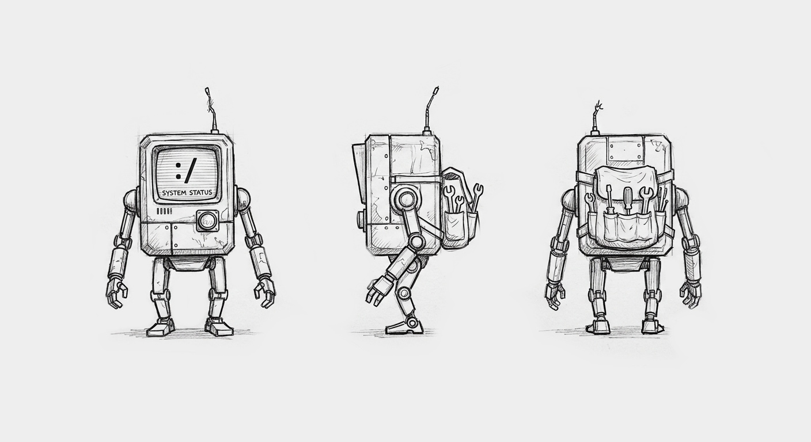

### 🤖 Aliados y Antagonistas Principales

| Entidad | Descripción visual |
|---|---|
| **PIP** | Mensajero robótico. |
| **CORE** | Inteligencia artificial representada mediante un ojo digital. |

| PIP | CORE |
|---|---|
| 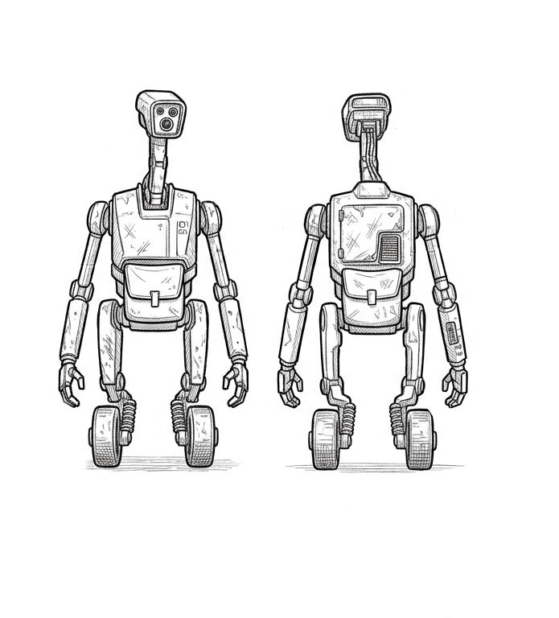 | 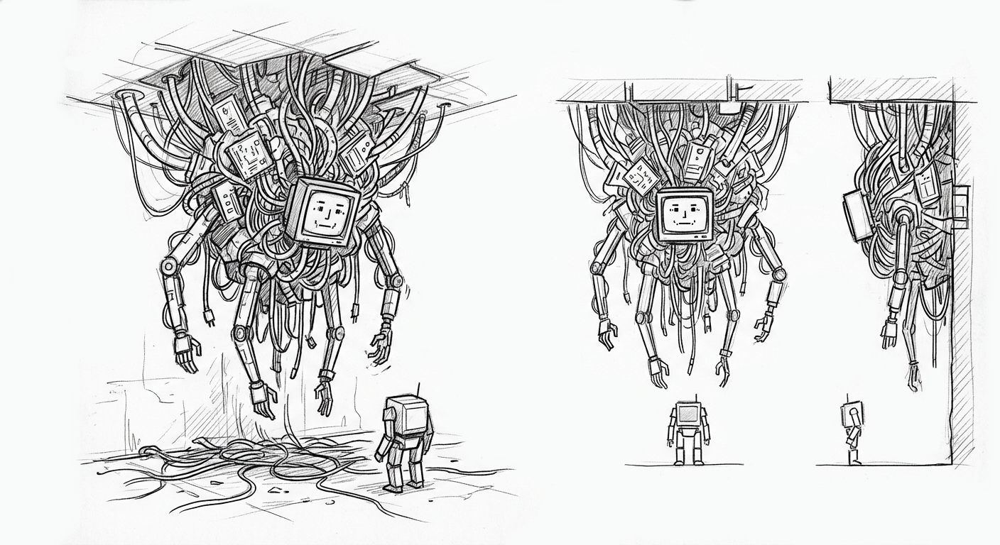 |

### 👑 Jefes de Sector

| Jefe | Concepto visual |
|---|---|
| **The Gardener** | Autómata agrícola del biodomo. |
| **The Conductor** | Entidad identificada como jefe de sector. |
| **The Watcher** | Entidad identificada como jefe de sector. |

| The Gardener | The Conductor | The Watcher |
|---|---|---|
| 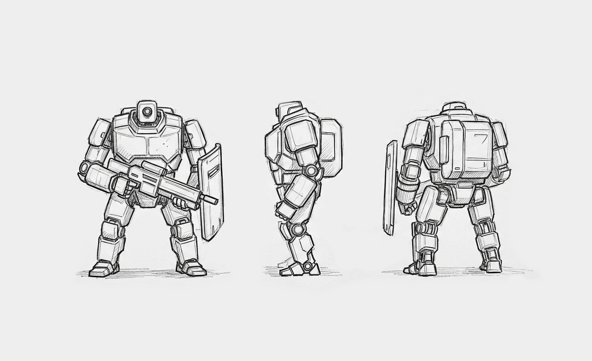 | 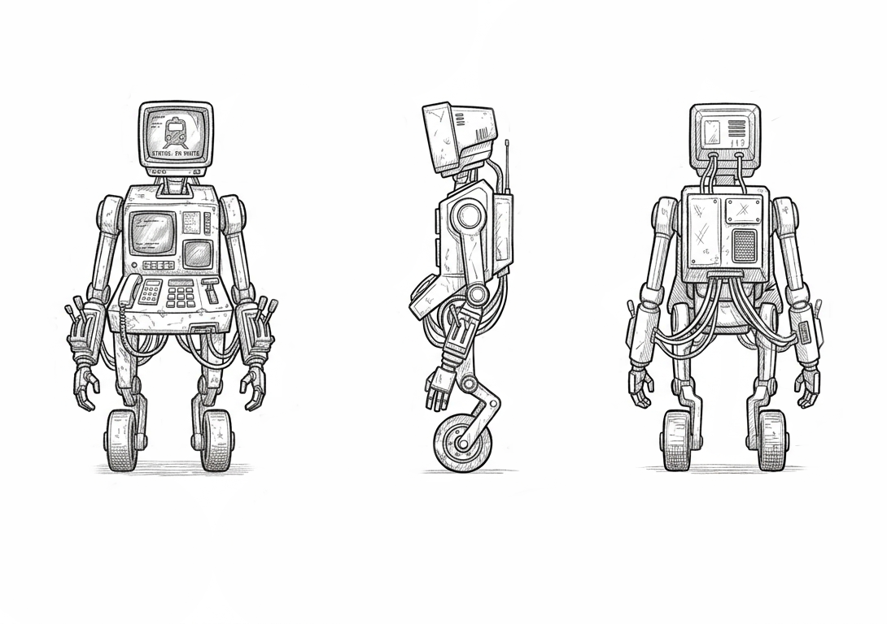 | 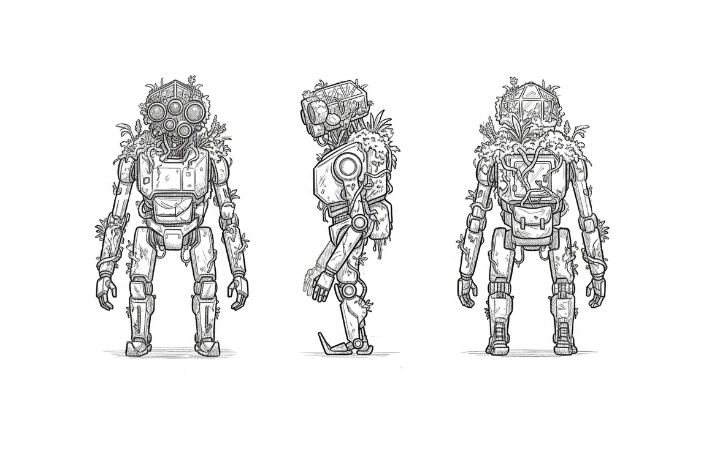 |

### ⚔️ Unidades Hostiles y Enemigos

Las unidades hostiles representan los distintos estados y tipos de amenaza que el jugador puede encontrar durante la exploración.

| Enemigo | Recurso gráfico |
|---|---|
| **Robot Defectuoso** | `Enemigo_Defectuoso.png` |
| **Robot en Alerta** | `Enemigo_Alerta.png` |
| **Robot Despierto** | `Enemigo_Despierto.png` |
| **Guardia de Seguridad** | `Enemigo_Guardia.png` |
| **Robot Reiniciado** | `Enemigo_Reiniciado.png` |

| Defectuoso | En Alerta | Despierto |
|---|---|---|
| 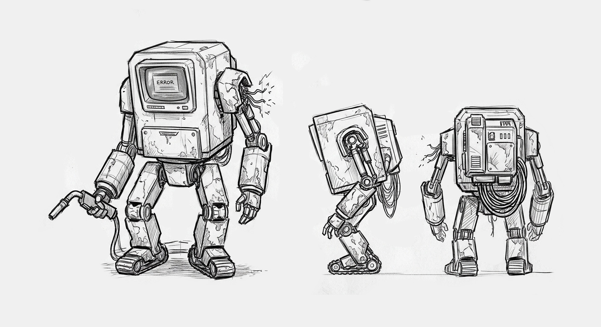 | 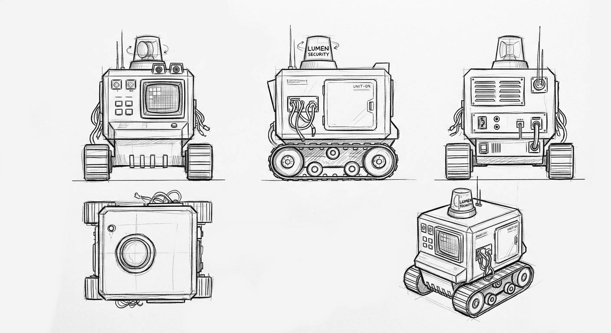 | 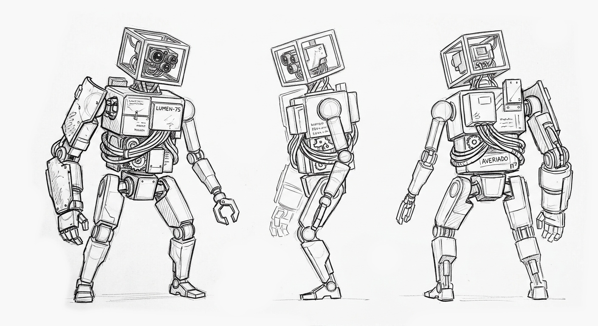 |

| Guardia | Reiniciado |
|---|---|
| 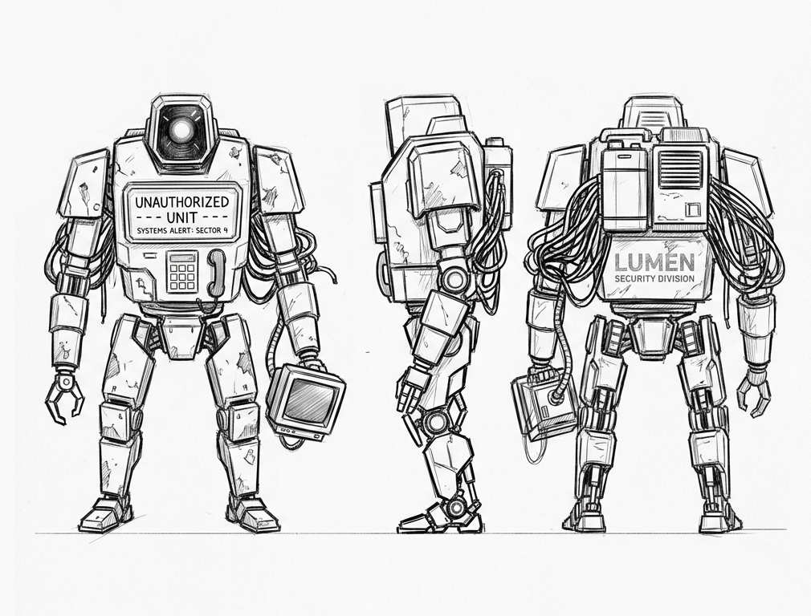 | 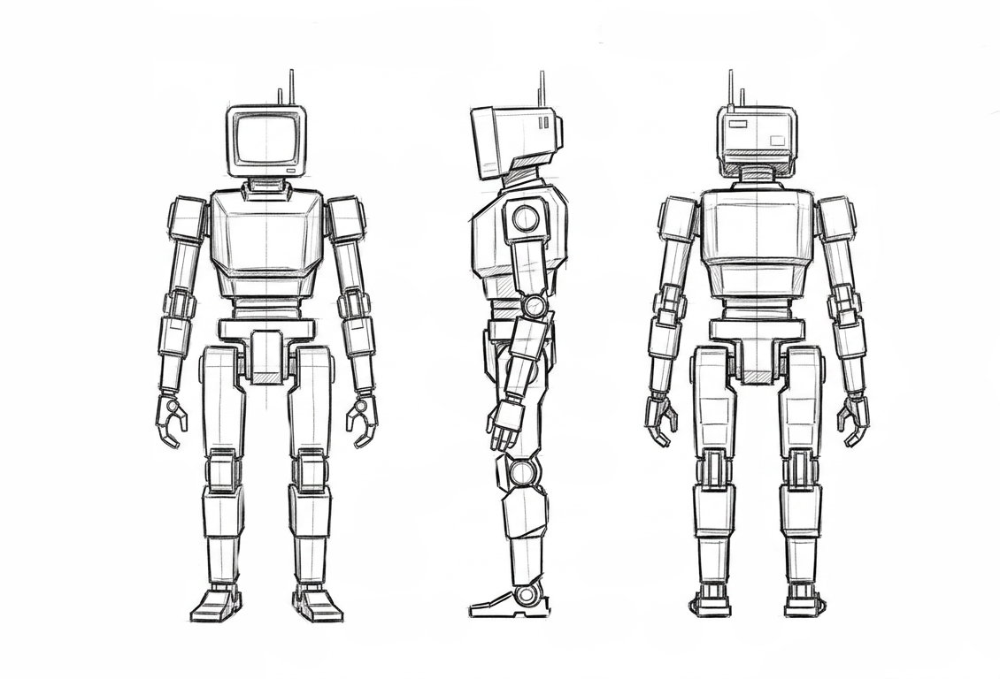 |

### 🛠️ Autómatas Secundarios (NPCs)

Los personajes secundarios enriquecen la ambientación del mundo y ofrecen encuentros durante la exploración.

| NPC | Recurso gráfico |
|---|---|
| **Unidad 73 - Limpieza** | `Unidad_73_Limpieza.png` |
| **Robot Agricultor** | `Robot_Agricultor.png` |
| **Robot Esperador** | `Robot_Esperador.png` |
| **El Mesero de Agua** | `El_Mesero_de_Agua.png` |

| Unidad 73 | Robot Agricultor |
|---|---|
| 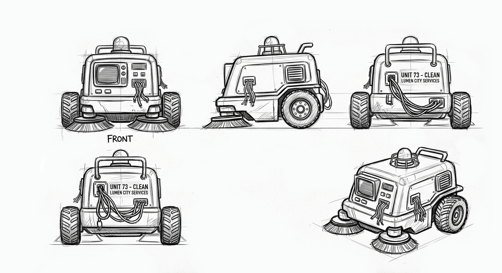 | 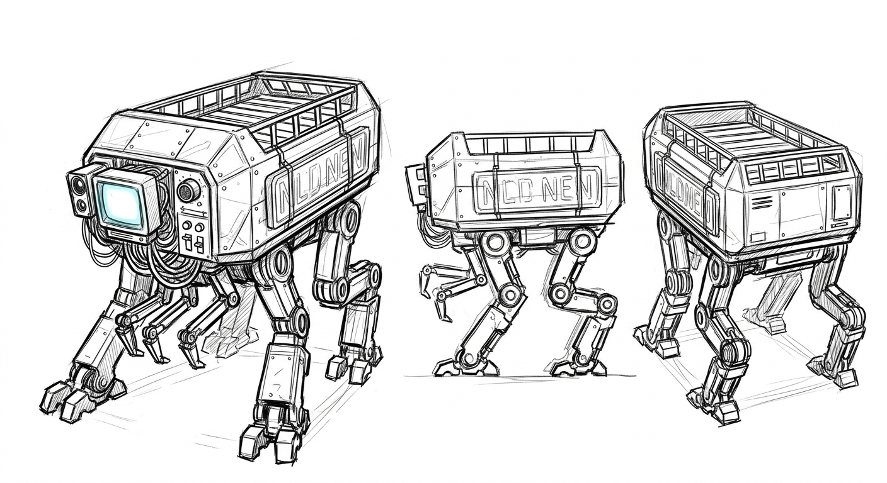 |

| Robot Esperador | El Mesero de Agua |
|---|---|
| 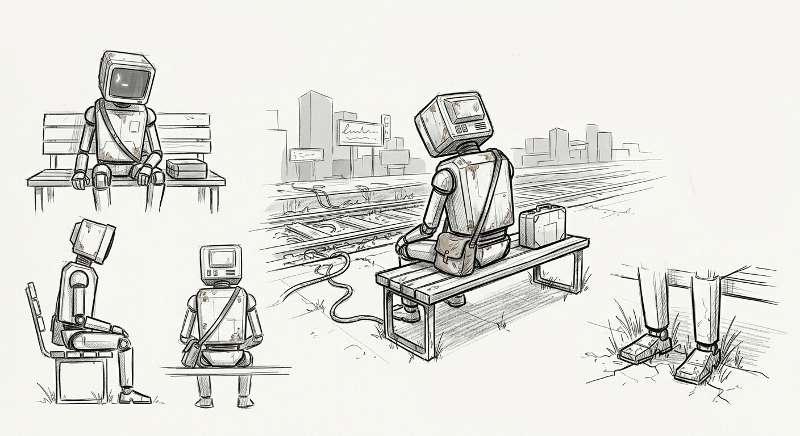 | 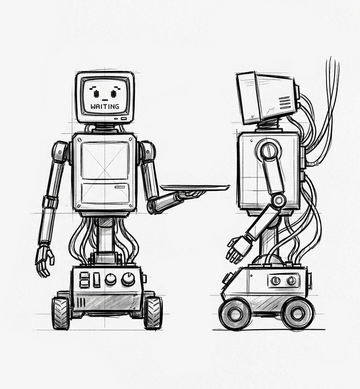 |

---

## 📁 Estructura del Repositorio

La siguiente estructura organiza los recursos gráficos, el proyecto de Unity y la documentación técnica de **LUMEN**.

```text
LUMEN/
├── assets/                              # Recursos gráficos para documentación
│   ├── protagonista/
│   │   └── M4_turnaround.png
│   ├── aliados_y_antagonistas/
│   │   ├── PIP_messenger.png
│   │   └── CORE_ai_eye.png
│   ├── jefes/
│   │   ├── The_Gardener_concept.png
│   │   ├── The_Conductor_concept.png
│   │   └── The_Watcher_concept.png
│   ├── enemigos/
│   │   ├── Enemigo_Defectuoso.png
│   │   ├── Enemigo_Alerta.png
│   │   ├── Enemigo_Despierto.png
│   │   ├── Enemigo_Guardia.png
│   │   └── Enemigo_Reiniciado.png
│   └── secundarios/
│       ├── Unidad_73_Limpieza.png
│       ├── Robot_Agricultor.png
│       ├── Robot_Esperador.png
│       └── El_Mesero_de_Agua.png
│
├── src/                                 # Proyecto de Unity
│   ├── Assets/
│   │   ├── Audio/                       # Bancos y eventos FMOD
│   │   ├── Prefabs/                     # Modelos y objetos interactivos
│   │   ├── Scenes/                      # Escenas del videojuego
│   │   ├── Scripts/                     # Código C# y sistemas del juego
│   │   └── Shaders/                     # Shaders retro y postprocesado CRT
│   └── ProjectSettings/
│
├── docs/                                # Documentación del proyecto
│   └── GDD_LUMEN_v1.0.pdf              # Game Design Document
│
└── README.md                            # Documentación principal
```

---

## 👥 Gestión del Equipo y Metodología

El desarrollo de **LUMEN** se organiza mediante la metodología ágil **Scrum**, con seguimiento del trabajo en Jira y sprints semanales durante un periodo estimado de ocho semanas, a partir del **28 de septiembre de 2026**.

| **Integrante** | **Rol** | **Principales responsabilidades** | **Perfil** |
|---|---|---|---|
| **Erick Matias** | Project Manager / Tester QA | Gestión del backlog en Jira, pruebas de calidad y control de riesgos. | [@EMATIAS](https://github.com/EMATIAS230045) |
| **Derek Sesni** | Lead Programmer / Game Designer | Arquitectura en C#, mecánicas de juego, integración de FMOD y sincronización con la PWA. | [@DevFntxy](https://github.com/DevFntxy) |
| **Diego Rivera** | Artista 2D / 3D | Modelado Low-Poly en Blender, animaciones, texturizado PSX e interfaz visual. | [@DiegoMiguel04](https://github.com/DiegoMiguel04) |
| **José García** | Diseñador de Audio | Composición musical en LMMS/Cakewalk, diseño de SFX y mezcla en FMOD. | [@ppyo1234](https://github.com/ppyo1234) |

### 📅 Organización del trabajo

- **Metodología:** Scrum.
- **Herramienta de gestión:** Jira.
- **Duración estimada:** 8 semanas.
- **Duración de cada sprint:** 1 semana.
- **Inicio del proyecto:** 28 de septiembre de 2026.

---

## ⚠️ Gestión de Riesgos

La gestión de riesgos permite identificar problemas técnicos que podrían afectar el rendimiento, la integración y el cumplimiento de los objetivos de la demo.

| **Riesgo identificado** | **Impacto** | **Plan de mitigación** |
|---|---|---|
| **Incompatibilidad del shader CRT en GPUs integradas** | Alto | Implementar una opción en el menú para desactivar el postprocesado retro. |
| **Desfase en la sincronización del audio adaptativo (FMOD)** | Medio | Precargar los bancos de sonido durante la pantalla de carga inicial y verificar su disponibilidad. |
| **Retraso en la entrega de assets 3D con rigging** | Alto | Utilizar *greyboxing* en Unity para desarrollar y probar las mecánicas antes de integrar el arte final. |
| **Fallos de conexión con la PWA Terminal Codex** | Bajo | Mantener los datos pendientes localmente y sincronizarlos cuando se restablezca la conexión, si la arquitectura implementa esta capacidad. |

---

## 🚀 Instalación y Despliegue

### 💻 Requisitos mínimos para PC

| **Componente** | **Requisito** |
|---|---|
| **Sistema operativo** | Windows 10/11 de 64 bits |
| **Procesador** | Pendiente de test |
| **Memoria RAM** | Pendiente de Test |
| **Gráficos** | Pendiente de Test |
| **Almacenamiento** | Pendiente de Test |

*Los requisitos indicados son estimaciones del proyecto y deben validarse mediante pruebas en los equipos de destino.*

### 📥 Pasos para ejecutar el proyecto

1. **Clonar el repositorio:**

   ```bash
   git clone https://github.com/EMATIAS230045/Dimatrek-Services
   ```

2. **Abrir el proyecto en Unity.**

   Utiliza Unity 2022.3 LTS o la versión compatible configurada para el proyecto.

3. **Abrir la escena principal.**

   Desde el explorador de proyectos de Unity, navega hasta `Assets/Scenes/` y abre `EstacionCentral.unity`, si ese es el nombre y la ubicación de la escena principal.

4. **Ejecutar el videojuego.**

   Presiona el botón **Play** en el editor de Unity para iniciar la demo.

5. **Ejecutar una compilación independiente.**

   Si ya existe una versión compilada, ejecuta `LUMEN.exe` desde la carpeta de distribución correspondiente.

---

## 📌 Estado del Proyecto

**LUMEN** es un proyecto de videojuego con perspectiva isométrica 3D que combina exploración, reparación de mecanismos, combate, narrativa ambiental y una estética retrofuturista.

Este repositorio centraliza la documentación, los recursos gráficos y el proyecto de Unity para facilitar el desarrollo colaborativo y el seguimiento de la demo universitaria.
