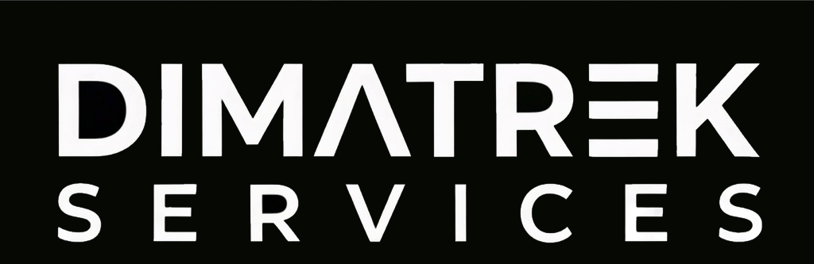

# 🚀 Dimatrek Services
<p align="center">
  
</p>

<p align="center">
  
</p>

<p align="center">
  <b>Estudio de Desarrollo de Videojuegos, Arquitectura de Software y Ecosistemas Digitales Multiplataforma.</b>
</p>

<p align="center">
  
  
  
  
</p>

---

## 🏢 Sobre Dimatrek Services

En **Dimatrek Services** nos especializamos en la conceptualización, diseño y desarrollo de experiencias interactivas y soluciones tecnológicas de alto impacto. 

Nuestra filosofía técnica combina el desarrollo de videojuegos en motores 3D (*Unity Engine*) con la construcción de **ecosistemas satélite conectando la nube**, integrando aplicaciones web progresivas (PWA), aplicaciones móviles de acompañamiento (*companion apps*) y servicios Backend en tiempo real via APIs REST.

---

## 🎮 Nuestros Juegos

Actualmente nos encontramos desarrollando nuestro proyecto insignia de aventura e investigación narrativa en un entorno post-humano:

### 🤖 LUMEN: Crónicas de una Ciudad Olvidada
> *Aventura de exploración narrativa, puzzles ambientales y combate táctico en vista isométrica 3D con estética retro PSX y filtro CRT.*

| Parámetro | Especificación del Proyecto |
|-----------|-----------------------------|
| **Estado** | Prototipo Próximo a Demo Jugable (Fase de QA) |
| **Plataformas** | PC Standalone (Windows) + PWA Companion App ("Terminal Codex") |
| **Protagonistas** | Unidad de Mantenimiento **M-4** & Robot Mensajero **PIP** |
| **Antagonista** | IA Central **CORE** & Protocolo **RESTORE** |
| **Tech Stack** | Unity 3D (C#), FMOD Studio, Node.js API REST, PWA |

👉 **[Consulta aquí el README Completo y Documentación de LUMEN](https://github.com/EMATIAS230045/Dimatrek-Services/tree/docs/ActualizarREADMEs/Lumen)** *(o enlace directo a tu repositorio de LUMEN)*

---

## 🛠️ Capacidades y Stack Tecnológico

El ecosistema de **Dimatrek Services** abarca diversas áreas del desarrollo de software moderno e ingeniería interactiva:

```text
                           +--------------------------------+
                           |       DIMATREK SERVICES        |
                           |   Hub Principal de Desarrollo  |
                           +---------------+----------------+
                                           |
        +----------------------------------+----------------------------------+
        |                                  |                                  |
+-------+-------+                  +-------+-------+                  +-------+-------+
|  GAME ENGINE  |                  |  BACKEND API  |                  | WEB & MOBILE  |
|  Unity (C#)   |                  | Node.js / Express|               | PWA & React   |
| FMOD Audio    |                  | REST Protocols|                  | Angular Apps  |
+---------------+                  +---------------+                  +---------------+
